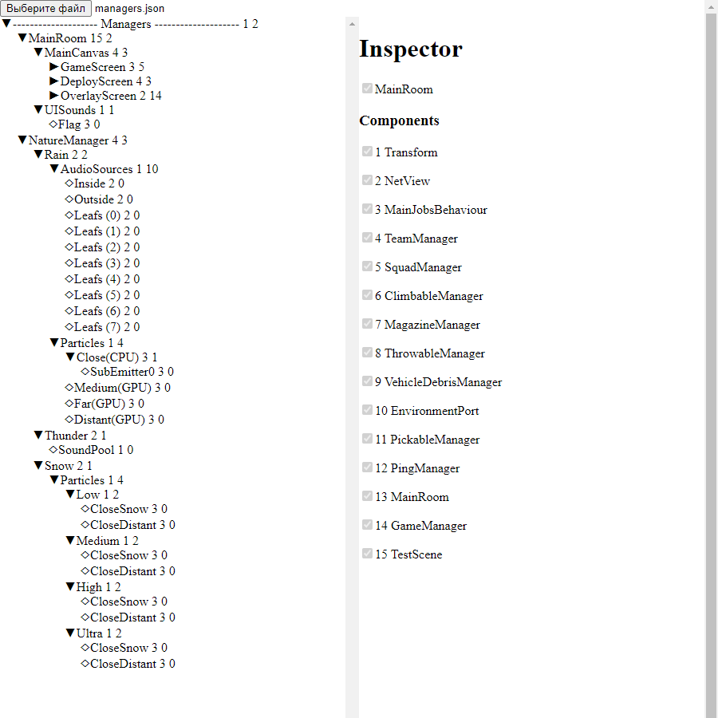

# vue3-tree-view

## Description
Simple app that allows to display hierarchy nested view. 

In my case is used to display dumped scene hierarchy from **Unity** games - such as gameobjects, their children's and its components.

Used as part of modding pipeline, it allows to investigate quicker where valuable data lives in :eyes:

## Todo
- [ ] design a website
- [ ] xml data support

## Try it yourself
https://kukumberman.github.io/vue3-tree-view/

## Structure
`sample.json`
```json
{
  "Name": "root",
  "Components": [],
  "Childrens": [
    {
      "Name": "music",
      "Components": [
        "Linkin Park",
        "Eminem"
      ],
      "Childrens": []
    },
    {
      "Name": "videos",
      "Components": [
        "MrBeast",
        "Zach King"
      ],
      "Childrens": []
    }
  ]
}
```

## Showcase
<table>
  <tr>
    <td>
      
    </td>
  </tr>
</table>

## Credits
- https://www.youtube.com/watch?v=VdSf6SFPiFg